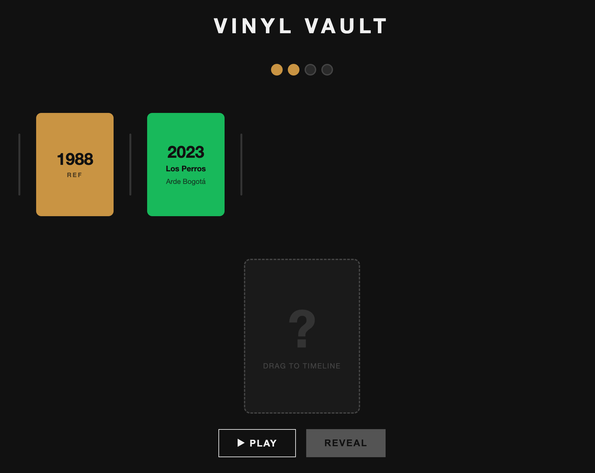

# 🎵 VinylVault — How to Play

VinylVault is a music trivia game where you build a timeline of songs by ear.
Just listen and guess where each track belongs in history!

---

## 🚀 Starting a game

Hit **START** and the game picks a random reference year (anywhere from 1960 to today).
That year becomes your **anchor card** — the first card on your timeline, and your first point.

---

## 🎧 Each round

Click **NEW SONG** to draw a card. The song starts playing from Spotify and a face-down
card appears in your staging area. You can toggle **PLAY / PAUSE** as many times as you
want before committing.

```
─── TIMELINE ───────────────────────────────
  ┌──────────┐
  │   1978   │
  │   REF    │
  └──────────┘
────────────────────────────────────────────

         ┌──────────┐
         │    ?     │  ← staging card (drag me!)
         │  ~~~~~~  │
         └──────────┘

         [▶ PLAY]  [REVEAL]
```




---

## 🖱️ Placing your card

Drag the face-down card from the staging area and drop it between any two cards
in the timeline. 

Changed your mind? No problem — drag the card again to a different spot.
The **REVEAL** button only lights up once the card is somewhere in the timeline.

---

## ✅ Revealing your answer

Click **REVEAL**. The game checks whether the song's actual release year fits
the position you chose.
  - 🟢 Correct. The card flips, and stays in the timeline. You just scored a point!
  - 🔴 Wrong. The card shakes red and disappears and your score remains the same. 

Wheter you were right or made a mistake, click **NEW SONG** and try again with the next track.

## 🔄 Full game flow

```
         ┌─────────┐
         │  START  │
         └────┬────┘
              │  fetch reference year + reset score
              ▼
    ┌──────────────────┐
    │  timeline: [REF] │  score = 1
    │  NEW SONG button │
    └────────┬─────────┘
             │ click NEW SONG
             ▼
    ┌──────────────────┐
    │  song card drawn │  (face-down, draggable)
    │  PLAY / PAUSE    │
    └────────┬─────────┘
             │ drag to timeline
             ▼
    ┌──────────────────┐
    │  card placed     │  REVEAL enabled
    │  (re-drag to     │  PLAY / PAUSE still works
    │   change mind)   │
    └────────┬─────────┘
             │ click REVEAL
             ▼
         ┌───┴───┐
    ✅ correct?  ❌ wrong?
         │              │
         ▼              ▼
  card stays in    card shakes red
  timeline          and disappears
  score + 1
         │              │
         └──────┬────────┘
                ▼
         score = WIN?
          ┌────┴────┐
         YES        NO
          │          │
          ▼          ▼
    🎉 YOU WIN!   NEW SONG
    PLAY AGAIN
```

---

## 🏆 Winning

Reach **4 points** (reference card + 3 correct placements) and the game is over!

Hit **PLAY AGAIN** to start fresh with a new reference year and a clean timeline.

---

## 🧠 Tips

- 🔍 **Listen for clues** — production style, instrumentation, and vocal tone all hint at the era.
- ❓ **Re-drag before you commit** — you can move the card as many times as you want before clicking REVEAL.
- 🎶 **Keep the music going** — the song keeps playing after a correct reveal, so you can enjoy it while you line up your next pick.
