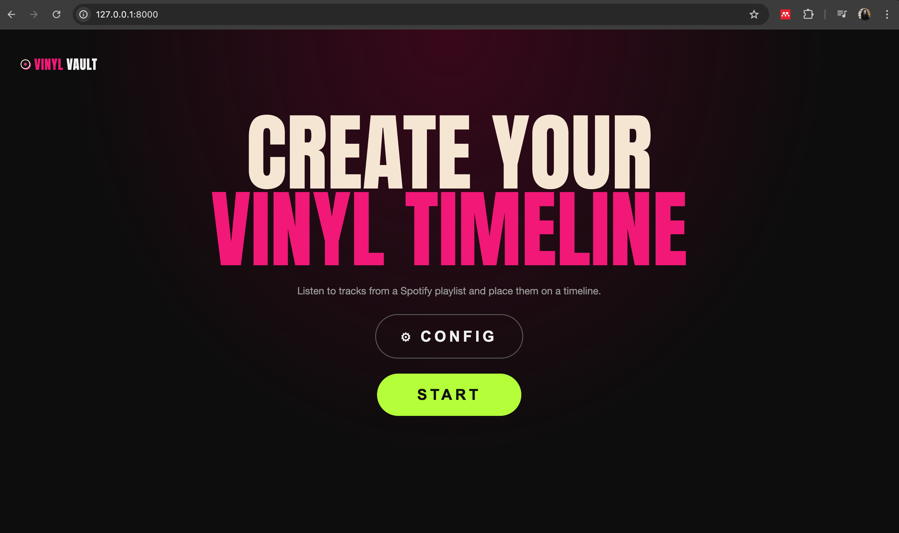
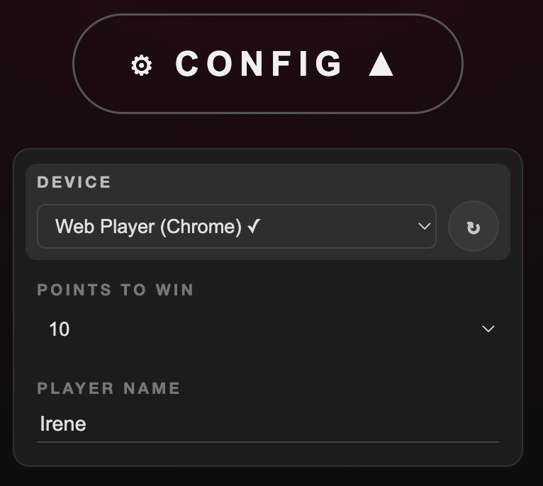
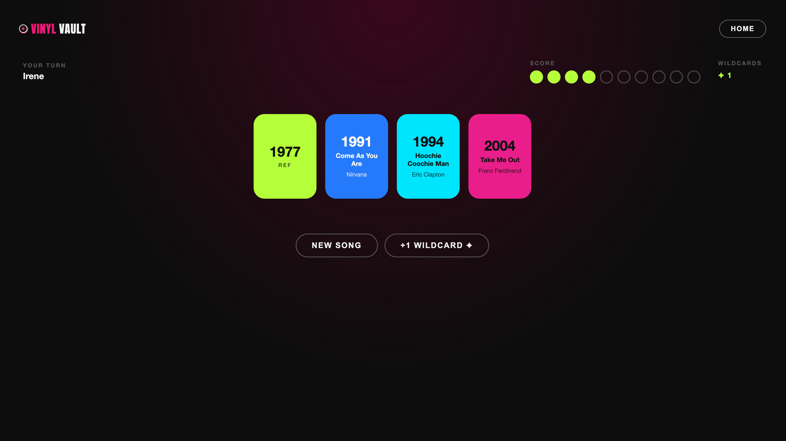
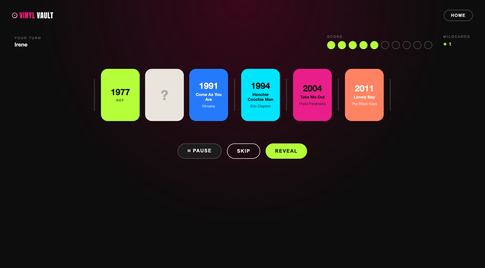
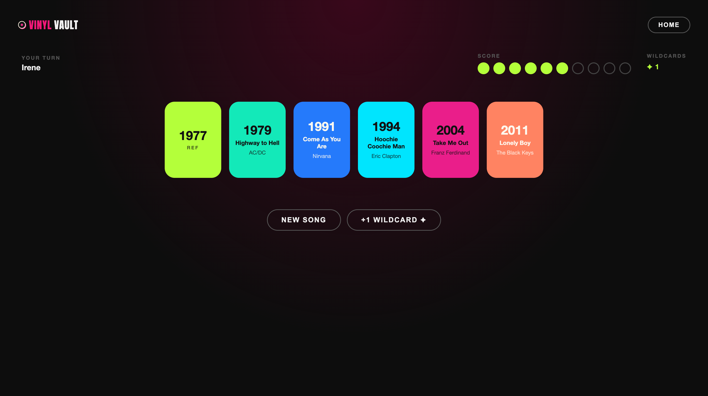
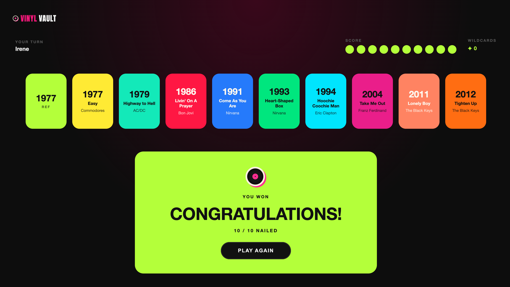

# 🎵 VinylVault — How to Play

VinylVault is a music trivia game where you build a timeline of songs by ear.
Just listen and guess where each track belongs in history!



---

## ⚙️ Configuration

Before starting, click **CONFIG** to customise the game:

| Setting | Description | Default |
|---------|-------------|---------|
| **Device** | The Spotify device that will play the music. You can choose between all devices where you are logged in on Spotify and it is open and active. | — |
| **Points to win** | How many correct placements are needed to win. | 10 |
| **Player name** | Your display name shown in the game header. | Player 1 |

> 💡 You must select a device before START becomes available.



---

## 🚀 Starting a game

Hit **START** and the game picks a random reference year (anywhere from 1960 to today).
That year becomes your **anchor card** — the first card on your timeline, and your first point.

---

## 🎧 Each round

Click **NEW SONG** to draw a card. The song starts playing from Spotify and a face-down
card appears in your staging area. You can toggle **PLAY / PAUSE** as many times as you
want before committing.



---

## 🖱️ Placing your card

Drag the face-down card from the staging area and drop it between any two cards
in the timeline. 

Changed your mind? No problem — drag the card again to a different spot.
The **REVEAL** button only lights up once the card is somewhere in the timeline.



---

## ✅ Revealing your answer

Click **REVEAL**. The game checks whether the song's actual release year fits
the position you chose.
  - 🟢 Correct. The card flips, and stays in the timeline. You just scored a point!
  - 🔴 Wrong. The card shakes red and disappears and your score remains the same. 

Whether you were right or made a mistake, click **NEW SONG** and try again with the next track.



---

## 🃏 Wildcards

Wildcards are bonus tokens you can earn — and spend — to shake things up.

### Earning a wildcard

Before clicking **REVEAL**, any player can shout out the song's title **and** artist.
If they got it right, after the reveal click **ADD WILDCARD** to bank one token.
The button disappears as soon as you draw the next song, so don't forget!

### Spending a wildcard

Not feeling a song? Click **SKIP** to burn one wildcard and immediately draw a fresh track.
The button is right there next to PLAY — no need to place the card first.
SKIP is greyed out when your wildcard count is zero, so you always know where you stand.

```
  Wildcards: 2   ← counter shown during the game
```

> 💡 Wildcards carry over between rounds — stock up on easy songs and spend them on the tricky ones!

---

## 🔄 Full game flow

```
         ┌─────────┐
         │  START  │
         └────┬────┘
              │  fetch reference year + reset score
              ▼
    ┌──────────────────┐
    │  timeline: [REF] │  score = 1
    │  NEW SONG button │
    └────────┬─────────┘
             │ click NEW SONG
             ▼
    ┌──────────────────────────────┐
    │  song card drawn             │  (face-down, draggable)
    │  PLAY / PAUSE / SKIP         │  SKIP available if wildcards > 0
    └──────┬──────────────┬────────┘
           │              │ click SKIP (uses 1 wildcard)
           │              └──────────► draw new song
           │ drag to timeline
           ▼
    ┌──────────────────┐
    │  card placed     │  REVEAL enabled
    │  (re-drag to     │  PLAY / PAUSE still works
    │   change mind)   │
    └────────┬─────────┘
             │ click REVEAL
             ▼
         ┌───┴───┐
    ✅ correct?  ❌ wrong?
         │              │
         ▼              ▼
  card stays in    card shakes red
  timeline          and disappears
  score + 1
         │              │
         └──────┬────────┘
                │  (named the song? → ADD WILDCARD)
                ▼
         score = WIN?
          ┌────┴────┐
         YES        NO
          │          │
          ▼          ▼
    🎉 YOU WIN!   NEW SONG
    PLAY AGAIN
```

---

## 🏆 Winning

Reach the **Points to win** target (default: 10) and the game is over!

The target is set in **CONFIG** before the game starts.

Hit **PLAY AGAIN** to start fresh with a new reference year and a clean timeline.



---

## 🧠 Tips

- 🔍 **Listen for clues** — production style, instrumentation, and vocal tone all hint at the era.
- ❓ **Re-drag before you commit** — you can move the card as many times as you want before clicking REVEAL.
- 🎶 **Keep the music going** — the song keeps playing after a correct reveal, so you can enjoy it while you line up your next pick.
- 🃏 **Call it out loud** — wildcards only land if someone names both the title *and* the artist before REVEAL. No silent victories!
- 💸 **Save wildcards for nightmares** — that one obscure B-side from 1973 is coming. You'll want the escape hatch ready.
