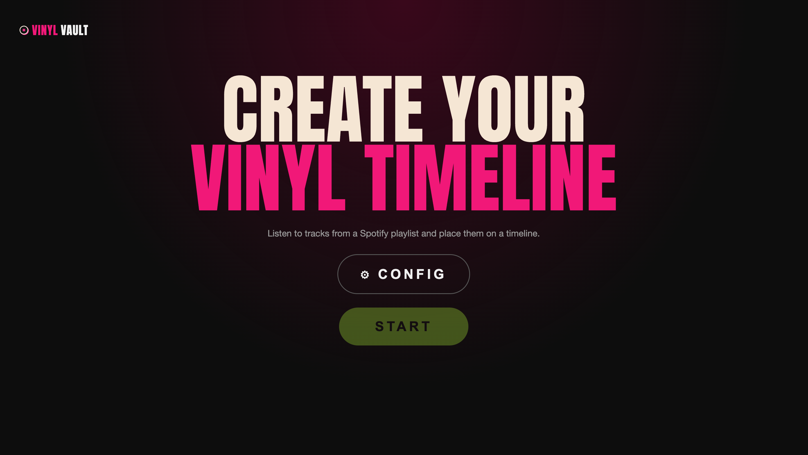
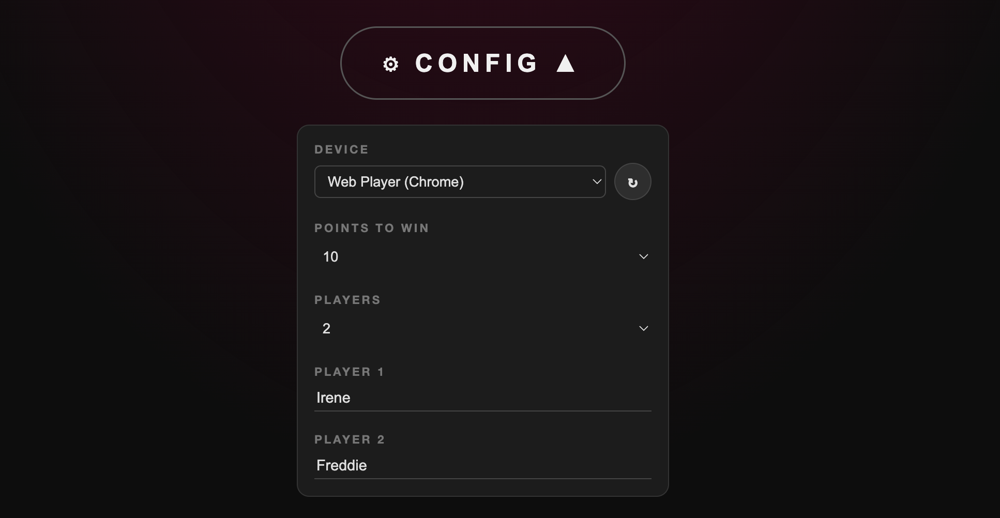
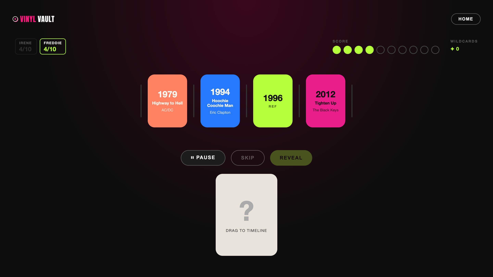
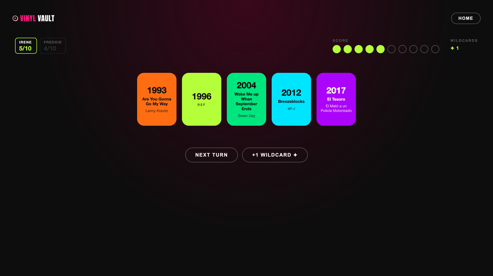
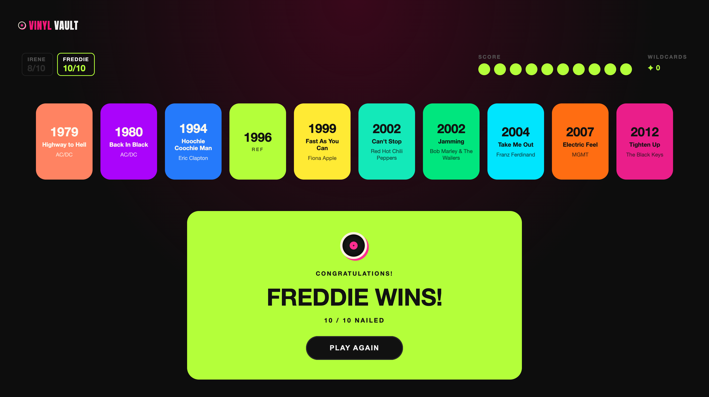

# 🎵 VinylVault — How to Play

VinylVault is a music trivia game where you build a timeline of songs by ear.
Just listen and guess where each track belongs in history!



---

## ⚙️ Configuration

Before starting, click **CONFIG** to customise the game:

| Setting | Description | Default |
|---------|-------------|---------|
| **Device** | The Spotify device that will play the music. You can choose between all devices where you are logged in on Spotify and it is open and active. | — |
| **Points to win** | How many correct placements are needed to win. | 10 |
| **Players** | Number of players in this game (1–4). Adding players creates a name field for each one. | 1 |
| **Player names** | Display name for each player, shown in the game header. | Player 1, Player 2, … |

> 💡 You must select a device before START becomes available.



---

## 🚀 Starting a game

Hit **START** and the game picks a random reference year (anywhere from 1960 to today).
That year becomes every player's **anchor card** — the first card on each player's independent timeline, and each player's first point.

Players take turns in the order they were named in CONFIG. The current player is highlighted in the topbar.

---

## 🎧 Each turn

Click **NEW SONG** to draw a card for the current player. The song starts playing from Spotify and a face-down card appears in the staging area. You can toggle **PLAY / PAUSE** as many times as you want before committing.



> 💡 Each player has their own independent timeline. You will never get a song that is already on the current player's timeline.

---

## 🖱️ Placing your card

Drag the face-down card from the staging area and drop it between any two cards in the timeline.

Changed your mind? No problem — drag the card again to a different spot.
The **REVEAL** button only lights up once the card is somewhere in the timeline.


---

## ✅ Revealing your answer

Click **REVEAL**. The game checks whether the song's actual release year fits the position you chose.

- 🟢 **Correct.** The card flips and stays in the timeline. The current player scores a point!
- 🔴 **Wrong.** The card shakes red and disappears. Score stays the same.

### After a correct reveal

The **+1 WILDCARD** and **NEXT TURN** buttons appear. The current player can:
1. Optionally click **+1 WILDCARD** if they (or someone else at the table) correctly named the song title **and** artist before the reveal.
2. Click **NEXT TURN** to pass to the next player.

### After a wrong reveal

- **3 or more players:** a popup announces the next player's name. Click **CONTINUE** to hand over.
- **2 players or fewer:** the turn advances automatically after 1.5 seconds.



---

## 🃏 Wildcards

Wildcards are bonus tokens each player can earn and spend independently.

### Earning a wildcard

After a correct reveal, the **+1 WILDCARD** button is shown alongside **NEXT TURN**.
If any player at the table correctly named the song's title **and** artist before the reveal, click **+1 WILDCARD** to award one token to the current player before ending the turn.
The button disappears when NEXT TURN is clicked, so don't forget!

### Spending a wildcard

Not feeling a song? The current player can click **SKIP** to burn one wildcard and immediately draw a fresh track.
The button is right next to PLAY — no need to place the card first.
SKIP is greyed out when the current player's wildcard count is zero.

> 💡 Wildcards are per-player and carry over between turns — stock up on easy songs and spend them on the tricky ones!

---

## 🔄 Full game flow

```
         ┌─────────┐
         │  START  │
         └────┬────┘
              │  fetch reference year + init players
              ▼
    ┌───────────────────────────────┐
    │  each player's timeline:      │  score = 1
    │  [REF]                        │
    │  NEW SONG (Player 1's turn)   │
    └────────────┬──────────────────┘
                 │ click NEW SONG
                 ▼
    ┌──────────────────────────────┐
    │  song card drawn             │  (face-down, draggable)
    │  PLAY / PAUSE / SKIP         │  SKIP available if wildcards > 0
    └──────┬──────────────┬────────┘
           │              │ click SKIP (uses 1 wildcard)
           │              └──────────► draw new song
           │ drag to timeline
           ▼
    ┌──────────────────┐
    │  card placed     │  REVEAL enabled
    │  (re-drag to     │  PLAY / PAUSE still works
    │   change mind)   │
    └────────┬─────────┘
             │ click REVEAL
             ▼
         ┌───┴───┐
    ✅ correct?  ❌ wrong?
         │              │
         ▼              ▼
  card stays in    card shakes red
  timeline          and disappears
  score + 1
         │              │
         ▼              ▼
  [+1 WILDCARD?]   3+ players:
  [NEXT TURN]       wrong popup →
                    CONTINUE
                    ≤2 players:
                    auto-advance
                         │
         └──────┬─────────┘
                │  next player's turn
                ▼
         score = WIN?
          ┌────┴────┐
         YES        NO
          │          │
          ▼          ▼
   🎉 [Name] wins!  NEW SONG
   PLAY AGAIN
```

---

## 🏆 Winning

The first player to reach the **Points to win** target (default: 10) wins the game!

Their name is shown on the win screen. Hit **PLAY AGAIN** to start fresh for all players — new reference year, clean timelines.



---

## 🧠 Tips

- 🔍 **Listen for clues** — production style, instrumentation, and vocal tone all hint at the era.
- ❓ **Re-drag before you commit** — you can move the card as many times as you want before clicking REVEAL.
- 🎶 **Keep the music going** — the song keeps playing after a correct reveal, so you can enjoy it while you line up your next pick.
- 🃏 **Call it out loud** — wildcards only land if someone names both the title *and* the artist before REVEAL. No silent victories!
- 💸 **Save wildcards for nightmares** — that one obscure B-side from 1973 is coming. You'll want the escape hatch ready.
- 👀 **Watch the chips** — the topbar shows every player's score as `current/target`. Keep an eye on who's closing in on the win!
